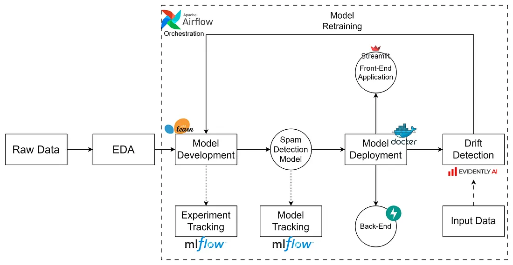

# 📬 noSpamML – Scalable Spam Detection Pipeline

A full-stack ML system for spam detection with end-to-end automation, monitoring, and user interaction.

---



> 🔁 End-to-end lifecycle: from raw data to model drift handling using Evidently and Airflow.

---

## 📌 Key Features

- ✅ End-to-end pipeline from data to deployment
- 🔎 Exploratory Data Analysis (EDA)
- 🧠 Machine learning model using `scikit-learn`
- 🧪 Spam classification with FastAPI backend
- 🖥️ Interactive Streamlit frontend
- 🐳 Dockerized infrastructure
- 📈 Drift detection using Evidently AI
- 🧬 Retraining automation via Apache Airflow
- 🧾 MLflow-based experiment tracking and model registry

---

##  Tech Stack

| Layer             | Tools Used                      |
|------------------|----------------------------------|
| Model Training    | scikit-learn, pandas             |
| Backend API       | FastAPI                         |
| Frontend UI       | Streamlit                       |
| Experiment Logs   | MLflow                          |
| Drift Detection   | Evidently AI                    |
| Containerization  | Docker, Docker Compose          |
| Orchestration     | Apache Airflow                  |
| Language          | Python 3.8+                     |

---


---

##  Running Locally (Step-by-Step)

### 1. Clone the Repository

Use Git to pull the project into your machine.
> git clone https://github.com/riyazmullaji/noSpamML.git


### 2. Build & Start with Docker Compose

All services are dockerized (frontend, backend, MLflow).

> docker-compose up --build


After successful build, services run at:
- Streamlit UI: `http://localhost:8501`
- FastAPI backend: `http://localhost:8000/docs`
- MLflow UI: `http://localhost:5000`

### 3. Access Streamlit Frontend

- Visit `http://localhost:8501` in browser
- Upload a message or input text
- Get prediction: `Spam` or `Not Spam`

### 4. Access FastAPI Backend

- Visit `http://localhost:8000/docs`
- Use built-in Swagger UI to test `/predict` endpoint

## 📉 Drift Detection & Model Retraining

In production, models often degrade over time due to data changes. **noSpamML** integrates automated **data drift detection** and **conditional model retraining** using:

- 🔍 **Evidently AI** – for detecting statistical drift in input data
- 🐍 Python scripts – to retrain model on new/augmented data
- 🛠️ **Airflow** – to orchestrate monthly drift checks and trigger retraining pipelines
- 🐳 Docker – containerized execution for repeatability and deployment

### 🔁 How it works

1. **Drift Check**:
   - Runs `drift_detection.py`
   - Compares current input vs reference dataset (training data)
   - If drift is detected, returns `True`

2. **Conditional Retraining**:
   - If drift is `True`, `model_retrain.py` is triggered
   - Re-trains a new model using fresh data
   - Saves model artifact to `/spam_backend/app/spam_classifier_pipeline.pkl`

3. **Airflow DAG**:
   - Monthly schedule (7th of each month)
   - Controls flow using:
     - `DockerOperator` for script containers
     - `ShortCircuitOperator` to conditionally skip/execute retraining
   - Uses `XComs` to pass drift detection result between tasks

4. **Docker Image**:
   - Custom-built: `drift_detection_env:1.0`
   - Includes: `pandas`, `scikit-learn`, `evidently`, `numpy`

### 🗃️ Paths & Volumes (Example)

- `/opt/airflow/scripts/project_spam_classifier/drift_detection.py`
- `/opt/airflow/scripts/project_spam_classifier/model_retrain.py`
- Training data: `/opt/airflow/scripts/dataset/training_data.csv`
- Output model: `/opt/airflow/spam_backend/app/`

> Volumes mounted inside Airflow's `docker-compose.yaml` via absolute paths. Adjust them to your local paths as needed.

---

### ✅ Sample Workflow Summary

```text
              Input Data
                  ↓
         [Evidently AI Check]
        drift_detection.py
          ↓        ↓
    [Drift: False]  [Drift: True]
       No action     ↓
              model_retrain.py
                    ↓
       Updated Model Stored & Used
```


> 🛡️ noSpamML aims to build trust in communication by catching unwanted content before it reaches users 

